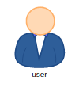
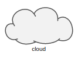
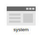
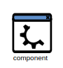

# SmartAnts

Это продвинутый инструмент презентации архитектуры. Он позволяет не только наглядно
визуализировать ландшафт, но и проигрывать анимационные сценарии, которые помогают широкому кругу
пользователей вникать в архитектурный замысел.

**ВНИМАНИЕ:** Это Beta версия. Она интенсивно развивается. В ее работе может возникать неоптимальность 
построения ландшафта или прокладки маршрутов связей. 

## Простейшее представление

```yaml
  ...
  dochub.smartants.examples.simple:
    location: DocHub/Руководство/Документы/Представления/01 Простой пример
    autor: R.Piontik
    type: smartants           # Тип документа
    source:                   # Задаем константные данные для генерации диаграммы
      config:                 # Конфигурируем расположение элементов на диаграмме 
        distance: 120         # Дистанция между элементами
        trackWidth: 24        # Ширина дорожек (треков)
      nodes:                  # Определяем элементы диаграммы
        system:               # Идентификатор элемента. Определяем иерархию при отображении диаграммы
          title: Система      # Название компонента
          symbol: system      # Символ (примитив) которым будет представлен элемент на диаграмме
        user:
          title: Пользователь
          symbol: user
      links:                    # Связи между компонентами
        - from: user            # Откуда будет прокладываться маршрут
          to: system            # Куда
          title: Логин и пароль # Описание маршрута
          style: "->"           # Направление маршрута <- / -> / <->
          link: "/docs/dochub.plantuml" # Ссылка перехода при клике на надпись
        - from: system
          to: user
          title: JWT токен
          style: "->"
          link: "/docs/dochub.swagger"
  ...
```
Результат генерации:


Обратите внимание, что вы можете взаимодействовать в диаграммой. Мышкой кликните по любому элементу и вы увидите
как по дорожкам "побегут муравьи", которые наглядно продемонстрируют направления связей компонентов.

Клик по надписи дорожке приведет к переходу на связанный документ. URL может быть любым.

Слева вверху находится Toolbar, который предоставляет дополнительные функции по взаимодействию с диаграммой. 
Например, воспользовавшись кнопкой "Экспорт в Excalidraw" вы можете выгрузить диаграмму в редактор [Excalidraw](https://excalidraw.com/)
для последующей дополнительной обработки с целью встраивания в презентацию, например, в PowerPoint.

Клик на кнопке "Свернуть связи в жгуты" приведет к упрощению диаграммы. Останется только одна связь, наглядно демонстрирующая о наличии 
взаимодействия объектов, но скрывающая детали. Это очень удобно для анализа обширных ландшафтов с большим количеством связей.

## Отображение элементов с иерархией

Добавим на диаграмму домены. Пользователь будет помещаться во внешней среде, а система во внутренней.

```yaml
  ...
  dochub.smartants.examples.domains:
    location: DocHub/Руководство/Документы/SmartAnts/02 Зонирование диаграммы
    autor: R.Piontik
    type: smartants           
    source:                   
      config:                 
        distance: 120         
        trackWidth: 24        
      nodes:
        inside:                      # Определим домены 
          title: Внутренняя среда    
        outside:
          title: Внешняя среда
        inside.system:               # Добавим в идентификатор принадлежность к домену "inside"
          title: Система      
          symbol: system      
        outside.user:                # Аналогично для пользователя добавим домен "outside"
          title: Пользователь
          symbol: user
      links:                    
        - from: outside.user         # Модифицируем идентификаторы в связях      
          to: inside.system            
          title: Логин и пароль 
          style: "->"           
        - from: inside.system
          to: outside.user
          title: JWT токен
          style: "->"
  ...
```

В результате, система и пользователь будут помещены в области отображающие их принадлежность доменам.


## Интерактивное взаимодействия с диаграммой

Главной супер-силой "умных муравьев" является умение отвечать на вопрос: "Что здесь происходит?".
Для того, чтобы посмотреть на нее в деле, усложним диаграмму. В этот раз разместим данные для 
построения диаграммы в [отдельном файле](/documentation/docs/manual/docs/examples/sa-complex.yaml).

```yaml
  ...
  dochub.smartants.examples.complex:
    location: DocHub/Руководство/Документы/SmartAnts/02 Сложная диаграмма
    autor: R.Piontik
    type: smartants           
    source: examples/smartants.yaml   # Данные для диаграммы расположены в файла 
  ...
```

Результат:


Диаграмма выглядит сложной. Для ее разъяснения кликните мышкой, например, на "API шлюз". 
Будут подсвечен и анимирован весь его интеграционный ландшафт.

Удерживайте "SHIFT" и выбирайте другие объекты на диаграмме. Тем самым расширяя поле анализа.

## Анимированные сценарии

В некоторых случаях, для разъяснения смысла диаграммы, необходимо рассказать пользователю 
историю о том, что на ней изображено. Это задачу решают анимированные сценарии.

Добавим к диаграмме сценарий ее разъяснения ([содержимое файла](/documentation/docs/manual/docs/examples/sa-anim.yaml)):
```yaml
...
# Анимация
animation:
  # Здесь создаем именованные действия, которы будут доступны в сценариях
  actions:
    hello:                            # Идентификатор действия
    - action: info                    # Информировать пользователя. Доступны: clean / info / focus-node / focus-neighbors
      text: Давай я объясню как здесь все устроено   # Текст, который будет выводиться пользователю
    focus-user:                           
    - action: focus-node              # Установить фокус на объекте диаграммы
      target: outside.user            # RegEx выражение определяющее с какими идентификаторами будут выделены элементы диаграммы
    - action: info                    # Одно действие может иметь пакет команд, которые будут выполнены последовательно
      text: Это пользователь, которому мы предоставляем услугу
    focus-frontend:
    - action: focus-node
      target: outside.application
    - action: info
      text: Для этого он использует приложение для Android
    focus-apigateway:
    - action: focus-node              # Здесь просим выделить всех соседей
      target: inside.apigateway       # По маске
    - action: info
      text: Все запросы из приложений поступают в шлюз
    focus-apigateway-neighbors:
    - action: focus-neighbors         # Подсвечиваем всех соседей
      target: inside.apigateway       # Шлюза
    - action: info
      text: Шлюз маршрутизирует запросы в нужные системы
    focus-backend:
    - action: focus-node
      target: inside.backend
    - action: info
      text: Вся бизнес-логика реализуется здесь
    focus-database:
    - action: focus-node
      target: inside.postgres
    - action: info
      text: В этой базе данных хранится вся бизнес-информация
    focus-sso:
    - action: focus-node
      target: inside.sso
    - action: info
      text: Для авторизации используется отдельный сервис
    focus-redis:
    - action: focus-node
      target: inside.redis
    - action: info
      text: Активные сессии пользователей хранятся в этой базе
    bay:
    - action: info
      text: Теперь ты знаешь все.
    clean:
    - action: clean                   # Отчистить действия 
      target: ".*"                    # выполненные над всеми объектами на диаграмме
  # Из заранее описанных действий создаются сценарии
  scenarios:
    case1:                            # Идентификатор сценария
      title: Объясни мне, что здесь?  # Название сценария для пользователя
      steps:                          # Шаги 
      - action: hello                 # Идентификатор действия
        delay: 2000                   # Длительность шага в миллисекундах
        voice: true                   # Признак голосовой подсказки. Переход на следующий шаг не происходит пока не будет завершен синтез речи
      - action: focus-user
        delay: 2000
        voice: true
      - action: clean
      - action: focus-frontend
        delay: 2000
        voice: true
      - action: clean
      - action: focus-apigateway
        delay: 2000
        voice: true
      - action: focus-apigateway-neighbors
        delay: 2000
        voice: true
      - action: clean
      - action: focus-backend
        delay: 2000
        voice: true
      - action: clean
      - action: focus-database
        delay: 2000
        voice: true
      - action: clean
      - action: focus-sso
        delay: 2000
        voice: true
      - action: clean
      - action: focus-redis
        delay: 2000
        voice: true
      - action: clean
      - action: bay
        delay: 2000
        voice: true
...
```


Слева вверху диаграммы теперь есть выпадающий список со сценариями. Выберите нужный и нажмите кнопку "Play".

## Кастомные символы

В базовом наборе есть ограниченное количество символов:

|          User            |          cloud             |             system           |            component               |
|--------------------------|----------------------------|------------------------------| -----------------------------------|
|  |  |  |  |

Но при необходимости его можно без труда расширить.

```yaml
# Здесь определяются кастомные символы
symbols:
  cat: >  # Идентификатор символа
    <g xmlns="http://www.w3.org/2000/svg">
      ...
      здесь код SVG
      ...
    </g>
nodes:
  my-symbol:
    title: Мой символ
    symbol: cat
```
Исходник файла [здесь](/documentation/docs/manual/docs/examples/sa-symbol.yaml). Результат:


В Интернет есть масса каталогов SVG изображений, которыми вы можете воспользоваться для создания собственных символов. 
Например [этот](https://freesvg.org/). Для адаптации изображений (размеров и т.п.) также существуют [сервисы](https://www.iloveimg.com/).


## Генерация диаграмм из данных

Еще одной супер-силой "умных муравьев" является способность автоматически генерировать диаграммы из данных архитектуры. 

```yaml
  ...
  dochub.smartants.examples.simple-query:
    location: DocHub/Руководство/Документы/SmartAnts/06 Простой запрос к данным
    autor: R.Piontik
    type: smartants           
    source: >
      (
        /* Определяем фильтр для компонентов архитектуры */
        $matcher := /^[a-zA-Z]*\.[a-zA-Z]*$/i;
        /* Генерируем структуру для диаграммы */
        {
          /* Формируем ноды из компонентов */
          "nodes": $merge(components.$spread().(
            /* Получаем идентификатор компонента */
            $id := $keys()[0];
            /* Если идентификатор компонента удовлетворяет фильтру, создаем ноду */
            $matcher($id) ? {
                /* Отсекаем домен верхнего уровня для исключения отображения компонентов в иерархии */
                $split($id, ".")[1]: {
                    "title": *.title,
                    /* Преобразуем entity компонентов в понятные диаграмме символы actor -> user */
                    "symbol": *.entity = "actor" ? "user" : *.entity
                }
            }

          ))
        }
      )
  ...
```


В результате, мы получили сильно упрощенный аналог диаграммы [L1](/architect/contexts/dochub). 
А также на диаграмме есть ошибка. Они возникает из-за того, что компонент "Документы" не имеет символа. 

Следующий запрос устраняет эту проблему ([исходник](/documentation/docs/manual/docs/examples/sa-query.jsonata)):
```json
(
    /* Определяем константы */
    $rowHeight := 18;
    $fontHeight := 16;
    $fontWidth := 10;
    $padding := 8;
    /* Определяем фильтр для компонентов архитектуры */
    $matcher := /^[a-zA-Z]*\.[a-zA-Z]*$/i;
    /* Сохраняем ссылку на корень манифеста */
    $manifest := $;
    /* Готовим список нод */
    $nodes := $merge(components.$spread().(
        $id := $split($keys()[0], ".")[1];
        $matcher($keys()[0])  ? {
            $id: {
                "title": *.title,
                /* Для каждого элемента будет свой символ кроме "actor" */
                "symbol": 
                    *.entity = "actor" ? "user" 
                    : *.aspects ? "symbol-" & $id : "component",
                /* Получаем список аспектов */
                "aspects": *.aspects.(
                    $aspect := $lookup($manifest.aspects, $);
                    {
                        "title": $aspect.title,
                        "id": $
                    }
                ),
                /* Получаем список связей */
                "links": *.links[$matcher(id)].{

                    "from": $id,
                    "to": $split(id, ".")[1],
                    "style": direction,
                    "title": title
                }
            }
        }
    )); 
    /* Готовим символы */
    $symbols := $merge($nodes.$spread().(
        $id := "symbol-" & $keys()[0];
        /* Определяем количество аспектов для вычисления высоты символа */
        $aspectCount := $count(*.aspects);
        /* Определяем максимальную длину текста для вычисления ширины символа */
        $maxTitle := $max(*.aspects.($length($.title)));
        /* Вычисляем размеры символа */
        $width := $maxTitle ? $maxTitle * $fontWidth + $padding * 2 : 64; /* Умножаем на ширину символа */   
        $height := ($aspectCount + 1) * $rowHeight + $padding * 2; /* Умножаем на высоту строки */
        {
            $id: /* Генерируем символ */
                "<g>"
                    /* Создаем контейнер */
                    & "<rect width=" & $width & " height=" & $height & " fill=\"#eee\" stroke=\"#222\" rx=3 />"
                    /* Заполняем аспектами */
                    & $join($map(*.aspects, function($v, $i) {
                        "<a href=\"/architect/aspects/" & $v.id & "\" >"
                        & "<text x=6 y=" & ($i * $rowHeight + $padding + $rowHeight) & " style=\"font-size:" & $fontHeight & "\" fill=\"blue\">" & $v.title & "</text>"
                        & "</a>"
                    }))
                & "</g>"
        }
    ));
    {
        "config": {
            "distance": 130,
            "trackWidth": 24
        },
        "symbols": $symbols,
        "nodes": $nodes,
        "links": $nodes.*.links
    }
  )
```


[Далее](/docs/dochub.templates) 