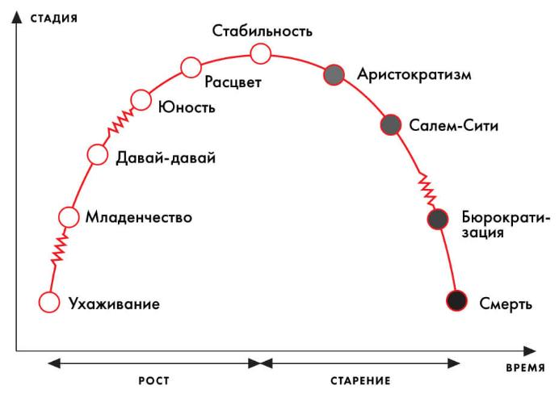

# Этапы развития бизнеса



На ранних стадиях владельцем архитектурного замысла является создатель бизнеса. С этапа "Давай-давай" начинается 
бурный рост организации. В управление архитектурным замыслом вовлекаются все больше число участников. 

Именно здесь, чаще всего, организация начинает осознавать потребность в управлении своей архитектурой.

Важно отметить, что с ростом зрелости меняется и суть потребности в управлении архитектурой. На ранних
этапах развития бизнес стремится занять свою нишу на рынке. Его потребность в архитектурной функции можно выразить так:

```
Генерация архитектурных решений для получения конкурентных преимуществ на целевом рынке.
```

Для этапа свойственны:
1. Потребность в быстрых проверках гипотез, что выражается в минимизации времени поставки ценности клиенту;
2. Высокая мутабельность процессов;
3. Роли чаще всего нечеткие и часто меняющиеся;
4. Готовность рисковать;
5. В приоритет ставятся маркетинговые показатели и выручка, а не прибыль;
6. Слабая документарная база.

**В приоритете скорость и уникальность поставляемых ценностей клиенту.**


Примерно на этапе "Расцвет" бизнес выходит на плато роста. В его фокусе появляется эффективность.

```
Генерация архитектурных решений для эффективного использования доступных ресурсов с целью доминирования на рынке.
```

Для этапа свойственны:
1. Отдельные маркетинговые активности, результат которых позволяет судить о необходимости что-то менять;
2. Фиксация успешных процессов в качестве стандартов организации;
3. Формирование ясной структуры организации;
4. Управление рисками;
5. В приоритет ставятся рентабельность и прибыльность;
6. Документарная база ярко выражена.

**В приоритете эффективность и адаптивность к меняющимся условиям рынка.**

