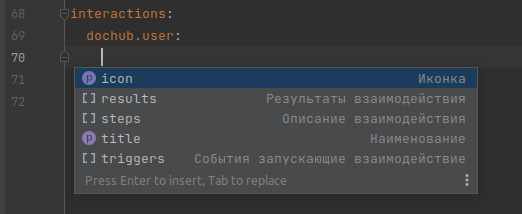
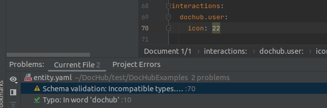
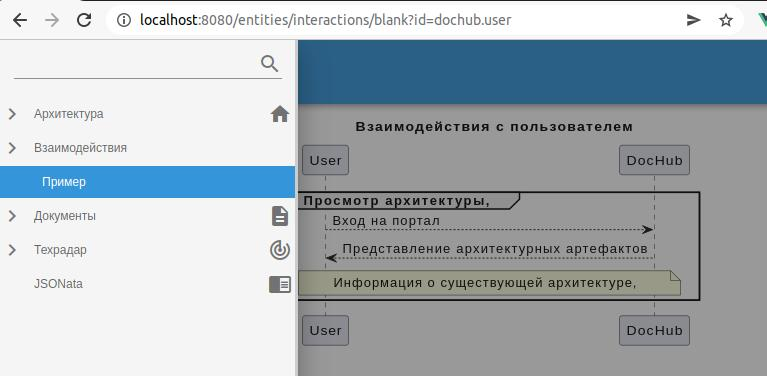
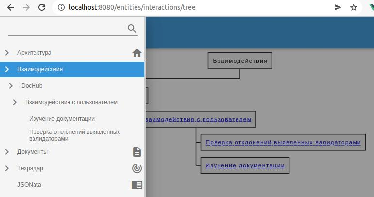
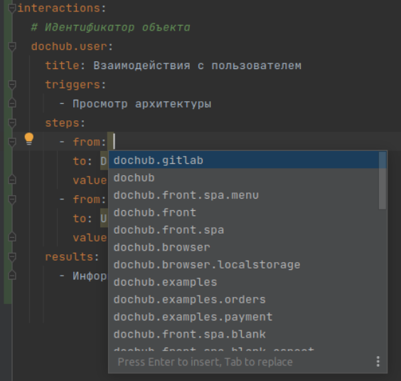
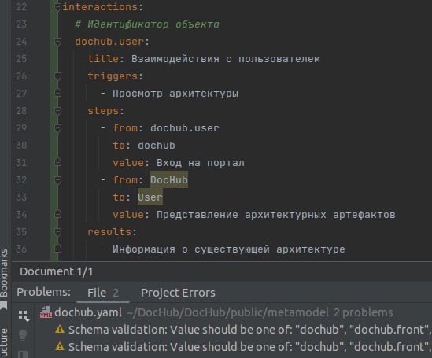
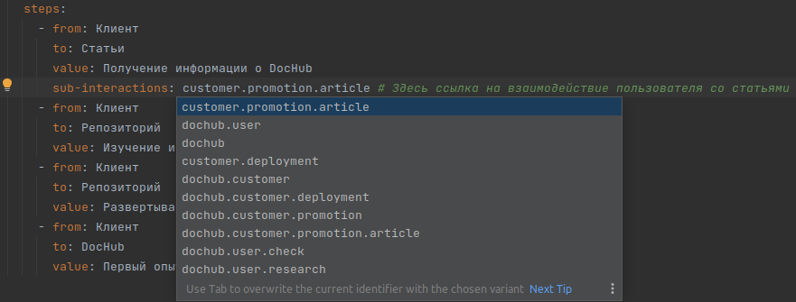

# Сущности(entities)

Метамодель DocHub можно расширять. Это позволяют делать кастомные сущности.

Предположим, что мы хотим описывать сценарии взаимодействия архитектурных компонентов. 
Для этого декларируем новую сущность - "interactions".

## Декларирование новой сущности

```yaml
entities:           # Здесь описываются кастомные сущности
  interactions:     # Идентификатор новой сущности. Обязательно.
    # Название сущности. Обязательно.
    title: Взаимодействия   
    # Описание сущности текст или ссылка на документ. Необязательно.
    description: >          
        Взаимодействия между компонентами
```

Данная запись сообщила DocHub, что в метамодели появилась новая сущность "interactions". 

Теперь, можно описать объект данной сущности.

```yaml
# Идентификатор сущности
interactions:
  # Идентификатор объекта
  dochub.user:
    title: Взаимодействия с пользователем
    triggers:
      - Просмотр архитектуры
    steps:
      - from: User
        to: DocHub
        value: Вход на портал
      - from: DocHub
        to: User
        value: Представление архитектурных артефактов
    results:
      - Информация о существующей архитектуре
```

В секции "interactions" находится произвольная структура. Ее образ и смысл полностью определяется задумкой автора.
DocHub, на этом этапе, ничего о ней не знает и делать с ней не умеет.


## Схема объектов сущности

Для того, чтобы DocHub мог контролировать структуру и наполнение объектов сущности "interactions", необходимо 
описать схему данных в специальном разделе "schema" с использованием [JSONSchema](https://json-schema.org/):

```yaml
entities:
  interactions:
    title: Взаимодействия
    description: >
      Взаимодействия между компонентами
    schema:
      # Секция "interactions" будет представлять из себя объект в понятии JSONSchema
      type: object
      # Идентификаторы его полей должны соответствовать паттерну структурированного идентификатора
      # состоящего из доменов разделенных точкой. Например: dochub.user
      # Фактически, объект будет реализовывать массив ключ-значение, где идентификатор поля это ключ,
      # а его значение - объект сущности.
      patternProperties:
        "[a-zA-Z0-9_]*(\\.[a-zA-Z0-9_]*)*$": # Шаблон 
          type: object  # Взаимодействие будет объект
          properties:   # со следующей структурой
            icon:       # Идентификатор иконки
              title: Иконка   # Описание поля, которое помогает понять его смысл и выдается в подсказках
              type: string    # Идентификатор может быть любой строкой
              minLength: 2    # Но ее длина не должна быть меньше двух символов
            title:       # Наименование сценария
              title: Наименование
              type: string
              minLength: 5
            triggers:   # Перечень причин вызывающий данный сценарий
              title: События запускающие взаимодействие
              type: array
              minItems: 1
              items:
                type: string
                minLength: 5
            steps:        # Шаги сценария
              title: Описание взаимодействия
              type: array
              minItems: 1 # Минимум один шаг
              items:
                type: object
                properties:
                  from:   # Откуда делается шаг
                    title: От кого
                    type: string
                    minLength: 1
                  to:     # Куда
                    title: Кому
                    type: string
                    minLength: 1
                  value:  # Что в нем происходит
                    title: Что
                    type: string
                    minLength: 1
              # Сообщаем, что перечисленные поля обязательны
              required:
                - from
                - to
                - value
            results:      # Результаты данного взаимодействия
              title: Результаты взаимодействия
              type: array
              minItems: 1
              items:
                type: string
                minLength: 5
        # Сообщаем, что перечисленные поля обязательны
        required:
          - title
```

Теперь DocHub знает как должна быть описана структура в секции "interactions" и может подсказывать при вводе кода 
в [плагине IDE](https://plugins.jetbrains.com/plugin/18518-dochub-architecture-as-code):



А также сообщать об ошибках:



Когда объекты описаны, можно получить от них пользу. Для этого понадобятся презентации.

## Презентация объектов

Презентации позволяют генерировать представления объектов. Это могут быть диаграммы, svg картинки, terraform код и т.п.

Для генерации используются [документы](/docs/dochub.docs). Вы можете использовать любой 
тип документа доступный в DocHub.

Для начала создадим карточку объекта. В ней будет отражаться диаграмма взаимодействия с использованием
[PlantUML](/docs/dochub.plantuml).

```yaml
entities:
    interactions:               
      ...
      presentations:            # Представления объектов сущности. Обязательно.
        blank:                  # Карточка объекта
          # Название представления
          title: Диаграмма взаимодействия
          # Параметры, которые требуются представлению в формате JSONSchema
          params:         
            type: object
            properties:
              id:
                type: string
            required:
              - id
          # Тип документа, который будет использоваться для представления
          type: plantuml
          # Шаблон, который будет использоваться для рендеринга документа
          template: templates/blank.puml
          # Источник данных для представления
          source: >       # Источник данных для рендера шаблона. Возвращает объект "interactions" по идентификатору переданному в параметрах.
              (
                  $lookup(interactions, $params.id) ~> | steps | {"from": $lookup($$.components, from).title, "to": $lookup($$.components, to).title}|
              )
      ...
```
Этот код описывает презентацию "blank" - карточку объекта. Поле "title" содержит название презентации, 
которое будет выводиться пользователю. 

Поле "params" декларирует требований к передаваемым параметрам для генерации презентации в формате [JSONSchema](https://json-schema.org/).
Если параметры не будут удовлетворять схеме, будет выведена ошибка.

"type" определяет, какой тип документа будет использоваться для данного представления. Документ может
накладывать требования к матаданным. В данном случае, от типа документа зависят поля "template" и "source".

"template" содержит относительный путь к шаблону на языке [mustache](https://mustache.github.io/).
Подробнее о шаблонах можно узнать [здесь](/docs/dochub.templates). 

Файл шаблона (templates/blank.puml) содержит код:
```mustache
@startuml
{{#.}}
title {{title}}
{{#triggers}}
group {{#triggers}}{{.}}, {{/triggers}}
{{/triggers}}
    {{#steps}}
    "{{from}}" --> "{{to}}": {{value}}
    {{/steps}}
    {{#results}}
    note across: {{#results}}{{.}}, {{/results}}
    {{/results}}
{{#triggers}}
end
{{/triggers}}
{{/.}}
@enduml
```

Данные для него готовятся [JSONata](https://jsonata.org/) запросом содержащимся в поле "source".
В запросе, в переменной $params, будут доступны параметры, которе передаются презентации. Например,
если в параметре "id" будет передано значение "dochub.user", то запрос вернут следующую структуру:

```json
{
    "title": "Взаимодействия с пользователем",
    "triggers": [
        "Просмотр архитектуры"
    ],
    "steps": [
        {
            "from": "User",
            "to": "DocHub",
            "value": "Вход на портал"
        },
        {
            "from": "DocHub",
            "to": "User",
            "value": "Представление архитектурных артефактов"
        }
    ],
    "results": [
        "Информация о существующей архитектуре"
    ]
}
```
Это описание объекта, которое мы создали ранее. Эти данные будут переданы в шаблон для синтезирования результата.

Теперь есть возможность увидеть представление в работе. Для этого в markdown документ необходимо встроить представление
нашего объекта. 

```

```

Результатом станет диаграмма:


Аналогичным образом создается презентация "tree" для визуализации иерархии сценариев взаимодействия в виде дерева. 
В отличии от презентации "blank", параметры ей не требуются. 

Встраиваем ее в markdown документ:

```

```

Результат:


Полный исходный код можно посмотреть [здесь](/documentation/entities/interactions/entity.yaml).

## Встраивание в меню

Чтобы пользователи могли найти описанные объекты, сущность имеет возможность расширять пользовательское меню.
Для реализации этой возможности в поле "menu" необходимо определить какие пункты и куда нужно встроить. 
В самом простом случае можно явно определить их размещение и ссылку на объект.

Например, код

```yaml
entities:
    interactions:
      ...
      menu: >
        (
          {
            "location": "Взаимодействия/Пример",
            "link": "/entities/interactions/blank?id=dochub.user"
          }
        )
      ...
```

сообщит DocHub, что необходимо в меню добавить пункт "Взаимодействия"->"Пример", который ведет на объект 
с идентификатором "dochub.user". Для адресации объекта указывается ссылка специального формата 
"/entities/interactions/blank?id=dochub.user". Где:

* **/entities/** - сообщает DocHub, что обращение идет к сущности;
* **interactions** - идентификатор сущности;
* **blank** - идентификатор презентации;
* **?id=dochub.user** - передаваемые параметры в формате URL;

Результат:



Обратите внимание, что в "menu" содержится запрос JSONata. Т.е. вы можете генерировать пункты меню произвольно.
Например, можно построить его в соответствии с иерархией объектов сущности "interactions".

```yaml
entities:
    interactions:
      ...
      menu: >
        (
          $interactions := $.interactions;
          $makeLocation := function($id) {(
              $arrleft := function($arr ,$count) {
                  $map($arr, function($v, $i) {
                  $i <= $count ? $v
                  })
              };
              $domains := $split($id, ".");
              "Взаимодействия/" & $join($map($domains, function($domain, $index) {(
                  $lookup($interactions, $join($arrleft($domains, $index), ".")).title
              )}), "/");
          )};
          $append([{
              "icon": *.icon,                                                  /* Получаем иконку */
              "link": "/entities/interactions/tree",                           /* Ссылка на форму представления tree (дерево дерево объектов "interactions") */
              "location": "Взаимодействия"                                     /* Расположение в меню */
          }
          ],
              [$.interactions.$spread().{
                  "icon": *.icon,                                             /* Получаем иконку */
                  "link": "/entities/interactions/blank?id=" & $keys()[0],    /* Формируем ссылку на бланк документ */
                  "location": $makeLocation($keys()[0])                       /* Формируем расположение в меню */
              }][location]
          );
        )
      ...
```

Результатом работы этого запроса будет древовидное меню доступа к объектам сущности "interactions".



Живой пример работы доступен вам из [меню](/entities/interactions/tree).

Поля структуры пункта меню:

* **icon** - (необязательно) иконка;
* **link** - (обязательно) URL ссылка относительная или прямая;
* **location** - (обязательно) путь размещения пункта меню в дереве меню;
* **order** - (необязательно) число, определяющее порядок вывода пункта меню (по умолчанию 10000).
              Пункты меню дополнительно сортируются по алфавиту.
              

## Специальный тип презентаций - upload

Данный тип презентаций служит для подготовки контента из данных архитектуры для последующего экспорта в виде файла.

Самым простым вариантом использования является выгрузка данных в формате JSON. 
Пример экспорта объекта сущности "interactions":

```yaml
entities:
    interactions:
      presentations:
        ...
            data:               # Экспорт данных сценария взаимодействия в формате JSON.
              type: upload      # Специальный тип документа.
              title: Выгрузка данных JSON
              params:           # JSONSchema контроля параметров
                type: object
                properties:
                  id:
                    type: string
                required:
                  - id
              source: >         # JSONata запрос возвращающие данные для выгрузки
                  (
                      $lookup(interactions, $params.id)
                  )
        ...
```

Презентация станет доступна в выпадающем меню. Кликните правой кнопкой мышки на диаграмме
и выберите пункт "Выгрузка данных JSON".


Более сложный пример для выгрузки BPMN диаграммы:

```yaml
entities:
    interactions:
      presentations:
        ...
          export:            # Экспорт взаимодействия в BPMN диаграмму
            type: upload     
            # Тип выгружаемого контента. По умолчанию application/json. 
            # Подробнее https://developer.mozilla.org/en-US/docs/Web/HTTP/Basics_of_HTTP/MIME_types
            mimetype: "application/xml" 
            # Генерация будет происходить на основании XML шаблона
            template: templates/bpmn.xml
            title: Экспорт в BPMN
            params:         
              type: object
              properties:
                id:
                  type: string
              required:
                - id
            # Готовим данные для шаблона - преобразуем сценарий взаимодействия в BPMN диаграмму
            source: >
              (
                $mul := 120;
                $lookup(interactions, $params.id).(
                    $this := $;
                    $body := {
                        "id": $params.id,
                        "start": {
                            "name": $this.triggers[0],
                            "stepid": "step0",
                            "outgoing": "flow0",
                            "shapey": $mul,
                            "labely": $mul - 30
                        },
                        "steps": $this.steps ~> $map(function($v, $i) { 
                            {
                                "name": $v.value,
                                "stepid": "step" & ($i+1),
                                "flowid": "flow" & ($i),
                                "incoming": "flow" & ($i),
                                "outgoing": "flow" & ($i+1),
                                "sourceRef": "step" & ($i),
                                "targetRef": "step" & ($i+1),
                                "shapey": ($i * $mul) + ($mul * 2),
                                "flowy": ($i * $mul) + ($mul * 2) - ($i = 0 ? 84 : 40),
                                "flowdy": ($i * $mul) + ($mul * 2)
                            }
                        })
                    };
                    $step_count := $count($body.steps);
                    $merge([$body, {
                        "end": {
                            "name": $this.results[0],
                            "stepid": "step" & ($step_count + 1),
                            "flowid": "flow" & ($step_count),
                            "incoming": "flow" & ($step_count),
                            "sourceRef": "step" & ($step_count),
                            "targetRef": "step" & ($step_count+1),
                            "shapey": $step_count * $mul + ($mul * 2) + 50,
                            "labely": $step_count * $mul - 30 + ($mul * 2) + 50,
                            "flowy": ($step_count * $mul) + ($mul * 2 - 40),
                            "flowdy": ($step_count * $mul) + ($mul * 2) + 54

                        }
                    }])
                )
              )
        ...
```

Содержимое шаблона "templates/bpmn.xml":

```xml
<?xml version="1.0" encoding="UTF-8"?>
<definitions xmlns="http://www.omg.org/spec/BPMN/20100524/MODEL" xmlns:bpmndi="http://www.omg.org/spec/BPMN/20100524/DI" xmlns:omgdi="http://www.omg.org/spec/DD/20100524/DI" xmlns:omgdc="http://www.omg.org/spec/DD/20100524/DC" xmlns:xsi="http://www.w3.org/2001/XMLSchema-instance" id="sid-38422fae-e03e-43a3-bef4-bd33b32041b2" targetNamespace="http://bpmn.io/bpmn" exporter="bpmn-js (https://demo.bpmn.io)" exporterVersion="11.1.0">
  <process id="{{id}}" isExecutable="false">
    <startEvent id="{{start.stepid}}" name="{{start.name}}">
      <outgoing>{{start.outgoing}}</outgoing>
    </startEvent>
    
    {{#steps}}
    <task id="{{stepid}}" name="{{name}}">
      <incoming>{{incoming}}</incoming>
      <outgoing>{{outgoing}}</outgoing>
    </task>
    <sequenceFlow id="{{flowid}}" sourceRef="{{sourceRef}}" targetRef="{{targetRef}}" />
    {{/steps}}

    <exclusiveGateway id="{{end.stepid}}" name="{{end.name}}">
      <incoming>{{end.incoming}}</incoming>
    </exclusiveGateway>
    <sequenceFlow id="{{end.flowid}}" sourceRef="{{end.sourceRef}}" targetRef="{{end.targetRef}}" />
  </process>
  <bpmndi:BPMNDiagram id="BpmnDiagram_1">
    <bpmndi:BPMNPlane id="BpmnPlane_1" bpmnElement="{{id}}">

      <bpmndi:BPMNShape id="step0_di" bpmnElement="step0">
        <omgdc:Bounds x="192" y="{{start.shapey}}" width="36" height="36" />
        <bpmndi:BPMNLabel>
          <omgdc:Bounds x="173" y="{{start.labely}}" width="73" height="14" />
        </bpmndi:BPMNLabel>
      </bpmndi:BPMNShape>

      {{#steps}}  
      <bpmndi:BPMNShape id="{{stepid}}_di" bpmnElement="{{stepid}}">
        <omgdc:Bounds x="160" y="{{shapey}}" width="100" height="80" />
      </bpmndi:BPMNShape>
      {{/steps}}

      <bpmndi:BPMNShape id="end_di" bpmnElement="{{end.stepid}}" isMarkerVisible="true">
        <omgdc:Bounds x="185" y="{{end.shapey}}" width="50" height="50" />
        <bpmndi:BPMNLabel>
          <omgdc:Bounds x="178" y="{{end.labely}}" width="66" height="14" />
        </bpmndi:BPMNLabel>
      </bpmndi:BPMNShape>

      
      {{#steps}}
      <bpmndi:BPMNEdge id="{{flowid}}_di" bpmnElement="{{flowid}}">
        <omgdi:waypoint x="210" y="{{flowy}}" />
        <omgdi:waypoint x="210" y="{{flowdy}}" />
      </bpmndi:BPMNEdge>
      {{/steps}}  

      <bpmndi:BPMNEdge id="{{end.flowid}}_di" bpmnElement="{{end.flowid}}">
        <omgdi:waypoint x="210" y="{{end.flowy}}" />
        <omgdi:waypoint x="210" y="{{end.flowdy}}" />
      </bpmndi:BPMNEdge>

    </bpmndi:BPMNPlane>
  </bpmndi:BPMNDiagram>
</definitions>
```

Теперь презентация станет доступна в выпадающем меню. Кликните правой кнопкой мышки на диаграмме
и выберите пункт "Экспорт в BPMN".


В результате будет сгенерирован файл, который вы сможете сохранить и открыть в 
[BPMN редакторе](https://demo.bpmn.io/).


## Ссылки на объекты сущностей

***Фича в развитии***

Ранее для полей "from" и "to" был определен тип "string": 

```yaml
...
  properties:
    from: 
      title: От кого
      type: string  # <<<<<<<<<<<<<<<<<<<
      minLength: 1
    to:     
      title: Кому
      type: string  # <<<<<<<<<<<<<<<<<<<
      minLength: 1
...
```
Такое описание схемы позволяет указать любое строковое значение в них. 
Но в некоторых случаях необходимо, чтобы значения полей соответствовали идентификаторам уже описанных объектов.
Т.е. ссылались на ранее описанные объекты.

В этом случае необходимо использовать системную схему ссылки на объекты необходимой сущности.  

Формат подключения схемы:

```
  #/$rels/<Идентификатор сущности>.<Тип поставляемого объекта>
```

Допустим, необходимо, чтобы поля "from" и "to" заполнялись идентификаторами компонентов.
Тогда схема должна быть следующей:

```yaml
...
  properties:
    from: 
      title: От кого
      $ref: "#/$rels/components.component"
    to:     
      title: Кому
      $ref: "#/$rels/components.component"
...
```

Теперь, при описании объекта сущности "interactions" в IDE (в настоящий момент доступно только в IDEA)
появится возможность выбрать идентификатор компонента из выпадающего списка.



Также, появляется возможность контролировать корректность указанных идентификаторов. 
IDE будет подсвечивать неверные.



Здесь значения "DocHub" и "User" подсвечиваются желтым цветом как неверные. 

## Декларирование объектов сущности

Для того, чтобы на объекты сущности можно было ссылаться, необходимо их декларировать.
Например, необходимо предоставить возможность ссылаться на сценарии взаимодействия. 
Для этого в описание сущности необходимо добавить секцию "objects":

```yaml
...
  objects:                    # Декларирование объектов сущности
    interaction:              # Объектом сущности является взаимодействие - "interaction"
      route: "/"              # Путь к массиву объектов в Data Lake относительно пути /interactions
                              # Если route не указан, то по умолчанию он равен "/"
      title: Взаимодействие   # Название объекта
      # JSONata генератор символа в svg для представления в диаграммах.
      #  $object  - передается объект рендеринга. Может быть не определен. В этом случае, необходимо вернуть неспецифичный (общий) символ объекта.
      #  $        - Data Lake архитектуры. Может быть не определен, если Data Lake недоступен.
      #
      # Если символ не определен, будет использован символ по умолчанию.
      symbol: >
        (
          '<svg xmlns="http://www.w3.org/2000/svg" viewBox="0 0 32 32" width="64px" height="64px">'
            & '<path d="M 16 3 C 14.148438 3 12.59375 4.285156 12.144531 6 L 6 6 L 6 12 L 3 12 L 3 20 L 6 20 L 6 26 L 12.144531 26 '
            & 'C 12.59375 27.714844 14.148438 29 16 29 C 17.851563 29 19.40625 27.714844 19.855469 26 L 26 26 L 26 20 L 29 20 L 29 '
            & '12 L 26 12 L 26 6 L 19.855469 6 C 19.40625 4.285156 17.851563 3 16 3 Z M 16 5 C 17.117188 5 18 5.882813 18 7 C 18 '
            & '8.117188 17.117188 9 16 9 C 14.882813 9 14 8.117188 14 7 C 14 5.882813 14.882813 5 16 5 Z M 8 8 L 12.144531 8 C 12.59375 '
            & '9.714844 14.148438 11 16 11 C 17.851563 11 19.40625 9.714844 19.855469 8 L 24 8 L 24 12 L 21 12 L 21 20 L 24 20 L 24 24 '
            & 'L 19.855469 24 C 19.40625 22.285156 17.851563 21 16 21 C 14.148438 21 12.59375 22.285156 12.144531 24 L 8 24 L 8 20 L 11 '
            & '20 L 11 12 L 8 12 Z M 5 14 L 9 14 L 9 18 L 5 18 Z M 23 14 L 27 14 L 27 18 L 23 18 Z M 16 23 C 17.117188 23 18 23.882813 '
            & '18 25 C 18 26.117188 17.117188 27 16 27 C 14.882813 27 14 26.117188 14 25 C 14 23.882813 14.882813 23 16 23 Z"/>'
          & '</svg>'
        )
...
```

Для демонстрации работы, модифицируем схему, добавив возможность на каждом шаге взаимодействия ссылаться 
на вложенное взаимодействие.

```yaml
...
  steps:
    title: Описание взаимодействия
    type: array
    minItems: 1
    items:
      type: object
      properties:
        from:
          title: От кого
          type: string
          minLength: 1
        to:
          title: Кому
          type: string
          minLength: 1
        value:
          title: Что
          type: string
          minLength: 1
        sub-interactions: # Добавляем поле, в котором можно указать ссылку на вложенное взаимодействие
          title: Вложенное взаимодействие
          $ref: "#/$rels/interactions.interaction"
    required:
      - from
      - to
      - value
...
```

Теперь опишем два взаимодействия, где второе будет ссылаться на первое. Для примера будет рассмотрен
сценарий привлечения потенциального клиента DocHub через статьи на [Хабр](https://habr.com/ru/users/rpiontik/).

Предполагаемый сценарий перехода потенциального клиента в репозиторий проекта с Хабр:
```yaml
interactions:
  ...
  dochub.customer.promotion.article:
    title: Статья на Хабре
    triggers:
      - Выдача в поиске
    results:
      - Переход в репозиторий
    steps:
      - from: habr
        to: dochub.customer
        value: Анализ новых статей
      - from: dochub.customer
        to: habr
        value: Чтение статьи о DocHub
      - from: dochub.customer
        to: dochub.gitlab.repository
        value: Переход в репозиторий
  ...
```

Сценарий привлечения потенциального клиента, где в первом шаге есть ссылка на сценарий выше:

```yaml
interactions:
  ...
  dochub.customer.deployment:
    title: Разворачивание DocHub
    triggers:
      - Первое знакомство с DocHub
    results:
      - Потенциальный клиент (лид)
    steps:
      - from: dochub.customer
        to: habr.articles
        value: Получение информации о DocHub
        sub-interactions: dochub.customer.promotion.article # Здесь ссылка на взаимодействие пользователя со статьями
      - from: dochub.customer
        to: dochub.gitlab.repository
        value: Изучение инструкции
      - from: dochub.customer
        to: dochub.gitlab.repository
        value: Развертывание
      - from: dochub.customer
        to: dochub
        value: Первый опыт
  ...
```

При редактировании поля "sub-interactions" IDE предложит варианты:



Теперь, для наглядности связности сценариев добавим возможность "проваливаться" во вложенные сценарии. 
Для этого модифицируем шаблон презентации "blank":

```mus
@startuml
...
{{/triggers}}
    ...
    "{{from}}" --> "{{to}}": {{#sub-interactions}}[[/entities/interactions/blank?id={{sub-interactions}} {{value}}]]{{/sub-interactions}}{{^sub-interactions}}
    ...
{{#triggers}}
...
@enduml
```

Результат:


