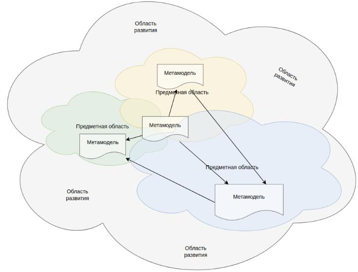

# Адаптивная метамодель

Архитектурная функция эволюционирует в соответствии с потребностями бизнес-единицы в которой она реализуется.
DocHub обеспечивает адаптивность метамодели для удовлетворения этих потребностей на всех этапах развития.

Подробно [здесь](https://habr.com/ru/post/701050/). 

## Концепция

Идея адаптивной метамодели заложена в утверждение - **Идеальной метамодели и нотации не существует.**



Наглядно видно, что метамодель это артефакт предметной области. Наличие формализованной метамодели зависит от уровня
ее зрелости и цифровизации в ней.

Помимо этого, чем менее зрелой предметная область является, тем выше у нее потенциал роста и мутабельность.

Единая метамодель, при такой оценке реальности, неприменима. Необходимо узаконить очевидный факт - метамодель
должна меняться и быть оптимальной как для предметной области так и для ее этапа зрелости. Уметь адаптироваться.

Также, метамодель обязана уметь связывать объекты различных предметных областей т.к. они часто "соприкасаются" 
в архитектурном ландшафте.

В отличии от многих инструментов управления архитектурой, DocHub не имеет жесткой, предопределенной метамодели и нотации. 
Вместо этого архитектору предоставляется свобода выбора и инструменты развития частной метамодели.

Решается это через:
1. **Entity** - Сущность предметной области. Например: "Стейкхолдер"; "Сервер"; "Информационный актив" и т.д. 
                Проще всего сказать, что это класс объекта в ООП. Но однозначное применение ООП здесь неуместно;
2. **Rules**  - Правила, позволяющие контролировать реализацию метамодели;
3. **Metamodel Bundle** - Пакет расширения метамодели. Содержат в себе комплекты сущностей, [валидаторы](http://localhost:8080/docs/dochub.rules.validators)
                , а также предопределенные объекты и документы. В качестве аналогии здесь можно привести библиотеки
                в языках программирования;

## Entity

Сущность формализует объекты предметной области, их взаимоотношения, а также представляет их в необходимой форме.

```yaml
entities:                     # Раздел описания сущностей метамодели
   interactions:              # Идентификатор сущности в метамодели
      # Матаданные самой сущности
      title: ...              # Название сущности.
      description: ...        # Описание сущности.
      menu: ...               # Если сущность должна встраиваться в меню, здесь описывается ее размещение.
      presentations: ...      # Представления объектов сущности. Представлением может быть любой тип документа.
      schema: ...             # Декларативное описание схемы метамодели объектов сущности.
``` 

Подробный пример описания можно найти [тут](/docs/dochub.entities.examples). Также можно изучить пример реализации нотации 
[C4 Model](https://github.com/rpiontik/DocHubExamples/tree/main/src/C4Model) и пример расширения презентаций уже существующих
сущностей путем встраивания [виджетов](https://github.com/rpiontik/DocHubExamples/tree/main/src/widgets).

## Metamodel Bundle

Бандл метамодели - самодостаточная, отчуждаемая часть кода архитектуры. Он может содержать все то же, что обычный код.
Целью его создания является - переиспользование архитектурного кода в сторонних архитектурных кодовых базах
в качестве зависимости.

Подробнее [здесь](/docs/dochub.flex_metamodel.bundle).

## Частная метамодель

Частная метамодель, это ансамбль необходимых **вам** бандлов, их расширений, а также описаний сущностей выполненных
**вами** для нужд **вашей предметной области**. 

Такой подход гарантирует адекватность метамодели действительным потребностям бизнес-единицы. Дает возможность удовлетворить их
как в настоящем, так и в будущем. Создает условия для успешности архитектора в поставки ценности от управления
архитектурой в адекватной форме и качестве. 


[Далее](/docs/dochub.radar)
