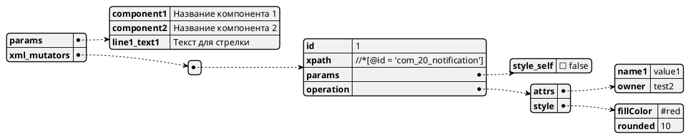
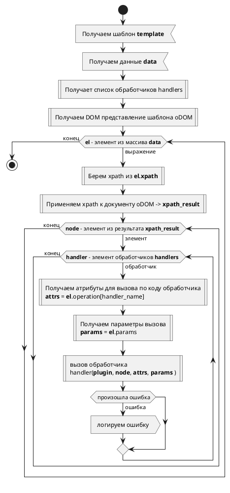

# Плагин для отображения файлов drawio

Плагин предназначен для отображения файлов в формате drawio в интерактивном интерфейсе.

**!Внимание!** Плагин работает в экспериментальном режиме, возможно есть ограничения в работе, которые тут явно не указаны.
О всех ошибках просьба сообщать для улучшений!

Для отображения поддерживаются форматы xml, svg и png с внедрением исходной диаграммы (!типы файлов требуют проверки).

Так же плагин поддерживает параметризацию показываемой диаграммы на основе данных из манифеста dochub.

**!Внимание!** Целевым форматом шаблонизации является XML формат drawio, для всех остальных форматов возможности шаблонизации ограничены и требуют отдельного исследования.

# Как настроить плагин для работы

Для того, чтобы плагин корректно работал необходимо в переменных окружения ( файл .env)
указать следующие параметры:

| Параметр | Описание | Значение по умолчанию
| --- | --- | -- |
| VUE_APP_DOCHUB_PLUGIN_DRAWIO_SERVER_URI | Адрес сервера DRAWIO для открытия интерфейса (см ниже) | https://embed.diagrams.net/?embed=1&ui=atlas&spin=1&modified=unsavedChanges&saveAndExit=0&noSaveBtn=1&noExitBtn=1&proto=json |
| VUE_APP_DOCHUB_PLUGIN_DRAWIO_LOAD_CUSTOM_HANDLERS | Разрешать ли загрузку дополнительных обработчиков XML из манифеста (см ниже) | false |


## Настройка ссылки на drawio сервер

Сам по себе сервер DRAWIO согласно документации используется только для загрузки кода редактора в браузер, а так же может использовать для вспомогательных действий вида экспорта в другой формат. Без необходимости файлы самих документов на сервер не отправляются.

Тем не менее в целях информационной безопасности можно использовать локальный сервер drawio для работы.
Варианты развертывания такого сервера выходят за рамки данного документа, но самый простой из способов: 
[Запуск в docker образа](https://www.drawio.com/blog/diagrams-docker-app)

```bash
docker run -it --rm --name="draw" -p 8080:8080 -p 8443:8443 jgraph/drawio
```

При этом в переменной VUE_APP_DOCHUB_PLUGIN_DRAWIO_SERVER_URI нужно указать полную ссылку для открытия редактора.

Рекомендуемые для использования на текущий момент параметры:
embed=1&ui=atlas&spin=1&modified=unsavedChanges&saveAndExit=0&noSaveBtn=1&noExitBtn=1&proto=json

Указанные параметры скрывают кнопки сохранения документа, так как плагин не реализует функциональность обновления документа в манифесте.

Подробнее об этом можно узнать [тут](https://www.drawio.com/doc/faq/embed-mode).

**Замечание**:
При самостоятельном формировании адреса ссылки необходимо обязательно указывать параметр proto=json

## Параметризация drawio диаграмм
Плагин поддерживает параметризацию drawio файла перед отображением.

Это означает, что файл из репозитория перед отображением используется как шаблон для применения у нему тех данных, которые возвращает запрос из параметра source документа dochub.

При этом поддерживает 2 вида шаблонизации: 
1. mustache шаблонизатор
2. обработчики на основе xpath и JS функций модификации DOM структуры XML документа

Оба указанных шаблонизатора можно использовать совместно.
Сначала применяется шаблонизатор mustache, а затем к результату его работу уже применяются обработчики xpath

### Шаблонизатор mustache

Шаблонизатор считает весь файл drawio шаблоном а данные берет из атрибута $.params результата запроса, указанного в параметре source документа.

Особенности шаблонизатора:
1. mustache ничего не знает о структуре файла - xml это или SVG или PNG файл, он просто найдет свои теги и заполнит их согласно своей логике.
2. В некоторых случаях масштабного использования тегов mustache файл без рендеринга шаблонизатором может стать нечитаемым в программе drawio

### Обработчики на основе XML и xpath 

Особенность подхода заключается в том, что базовый формат файлов DRAWIO - это XML со своим набором элементов, атрибутов и стилей.

А значит можно реализовать изменение этого файла средствами работы с XML, а выбрать места применения таких изменений с помощью XPATH.


#### Как это работает:
Обработчик действует по заранее определенному сценарию:
1. Взять результат работы шаблонизатора mustache
2. Распарсить его как XML в DOM структуру
3. Взять массив объектов по пути $.xml_mutators из запроса, указанного в параметре source документа
4. Для каждого из элементов массива:
5. Скомпилировать из атрибута $.xml_mutators.[].xpath xpath и применить его к документу, результат получаем в виде снапшота результатов запроса - он не изменится при редактировании самого DOM-документа
6. Для каждого результата запроса применить каждый из найденных по пути $.xml_mutators.[].operation обработчиков

Пример результата запроса, указанного в параметре source документа


Блок-схема работы алгоритма:



#### Подробнее об обработчиках:
Так-как формирование полноценного xslt документа для преобразования drawio файла довольно неудобно ( на JSONata наверное совсем не удобно и очень громоздко).

Было решено применить концепцию специализированных обработчиков для разных операций.

Каждый обработчик состоит из:
1. Мнемоники - по ней определяется какой именно обработчик необходимо применять.
2. Функции изменения - это функция на JavaScript которая принимает следующие параметры:
   1. plugin - объект плагина drawio ( для логирования рекомендуется использовать метод plugin.log)
   2. node - DOM-елемент найденный в результате xpath запроса
   3. attrs - содержимое объекта по пути $.xml_mutators.[].operation[ handler_code ], где handler_code - мнемоника обработчика. По сути это параметры применения этого обработчика к элементу node. Формат зависит от обработчика
   4. params - объект по пути $.xml_mutators.[].params По сути это конфигурация, в зависимости от данных тут может как-то меняться поведение того или иного обработчика.

Результат возврата функции игнорируется. 
Функция должна выполнить изменения DOM-элемента на месте путем его изменения.

#### Обработчик attrs

**Код обработчика:** attrs
**Название:** Установка или добавление атрибутов к выбранному через xpath элементу

**Примечание:** Зачем такое нужно?
В drawio есть понятие дополнительных данных.

В самом drawio эти параметры можно использовать для подстановки значений в текстовые 
шаблоны как самого элемента, так и дочерних элементов.
[Подробности](https://www.drawio.com/blog/placeholders)

**Преимущества:** Можно работать с данными в интерфейсе самого drawio, это нормально отображается.
При этом не нужно заморачиваться и учитывать стилистику вывода текста - это 
можно настроить штатными средствами в самом редакторе диаграмм.

**Опции работы (params):** параметров нет

**Как использовать:** Для удобства использовать можно назначать элементам на диаграмме свои идентификаторы
Для этого нужно:
1. кликнуть правой кнопкой мыши на элемент
2. выбрать пункт Edit Data
3. 2 раза кликнуть на ID элемента в верхней части диалогового окна
4. Внесни идентификатор

**Внимание!** Указанные действия не получится сделать во встроенном редакторе, т.к. он на текущий момент не поддерживает сохранение изменений.
При необходимости сохранения изменений из встроенного редактора необходимо воспользоваться пунктом меню 
**Файл -> Экспортировать как... -> XML...** (При выборе параметров экпорта не выбирать сжатие **(шаблонизация работать не будет)**)


**Формат атрибутов (attrs):** Формат - это объект, ключи которого являются 
ключами для добавления или установки значения, а значения - теми значениями, которые будут установлены

**Внимание!** Все идентификаторы в рамках диаграммы должны быть уникальными!

#### Обработчик style

**Код обработчика:** style
**Название:** Установка или добавление атрибутов **стиля** к выбранному через xpath элементу

**Примечание:** Зачем такое нужно?
Если параметризировать стиль объекта (например цвет фона элемента), то визуальное отображение в редакторе диаграмм ильно ухудшается (элементы становятся черного цвета и надписи могут сливаться).
При применении обработчика стиль не нужно предварительно заменять mustache тегом и в результате таких последствий нет.

Посмотреть какие есть стили можно:
1. выбрав элемент в редакторе диаграмм, 
2. нажав на нем правой кнопкой мыши
3. выбрать пункт меню Edit Style

В результате будет показана строка вида:
```
html=1;dropTarget=0;whiteSpace=wrap;
```
Данную строчку можно представить как отдельные атрибуты разделенные точкой запятой, каждый из атрибутов имеет значение, отделяемое от названия знаком равно.


**Опции работы (params):** 
Параметр style_self:
**возможные варианты:**
| Значение | Примечание |
| --- | -- |
| true | Атрибут style нужно искать прямо на том элементе, который получен от xpath |
| false | Атрибут style ищется на первом дочернем элементе mxCell относительно элемента, который получен от xpath |

**значение по умолчанию:** false

**зачем нужен параметр:** Стили часто вешаются не на элемент с id а на дочерний элемент mxCell - поведение по умолчанию упрощает формирование xpath для редактирования стиля, но может вызвать затруднение если стиль нужно поменять в другой структуре (требуется исследование и обратная связь)

**Формат атрибутов (attrs):** Формат - это объект, ключи которого являются 
именами элементов стиля, а значения - теми значениями, которые будут установлены для них.
При наличие элемента стиля - его значение заменяется.
При отсутствии элемента стиля - он добавляется с передаваемым значением

#### Добавление кастомного обработчика
Набор штатных обработчиков на текущий момент ограничен тем минимумом, который понадобился для начала прикладной работы с плагином.

Кому-то может понадобиться расширить эту функциональность.
Это можно сделать без пересборки плагина и редактирования его исходного кода следующим образом:
1. Установить значение переменной VUE_APP_DOCHUB_PLUGIN_DRAWIO_LOAD_CUSTOM_HANDLERS перед сборкой dochub в значение true
2. В метаданных определить объект 
```yaml
entities:
  config.plugin.drawio:
    handlers:
        мнемоника обработчика: |
            тело функции обработки, имена параметров на входе фиксированы
            # plugin - plugin object - use ( way use plugin.log )
            # node - dom Node object found by xpath expression
            # attrs - object with data to apply modification - format is handler specific
            # params - object with configs / modifiers of handlers

```


**Пример реализации указанных выше плагинов в виде кастомизации:**
```yaml
entities:
  config.plugin.drawio:
    handlers:
      # js function body with params:
      # plugin - plugin object - use ( way use plugin.log )
      # node - dom Node object found by xpath expression
      # attrs - object with data to apply modification - format is handler specific
      # params - object with configs / modifiers of handlers
      attrs: |
        plugin.log("change_attrs - start", node, attrs);
        for (var key of Object.keys(attrs)) {
          node.setAttribute(key, attrs[key]);
        }
        plugin.log("change_attrs - end", node);
      style: |
        plugin.log("change_style - start", node, attrs);
        // todo: check errors
        var style_node =  params.style_self ? node : node.getElementsByTagName("mxCell").item(0);
        var style_attr = style_node.getAttribute("style");
        var style_obj = style_attr.split(";")
            .reduce( function(res, el) {
                var items = el.split("=");
                if (items[0])
                    res[items[0]] = items[1] ;
                return res;
            }, {} );

        for (var key of Object.keys(attrs)) {
            style_obj[key] = attrs[key];
        }

        plugin.log("change_style - style apply", style_obj);

        var style_res = [];
        for (var key of Object.keys(style_obj)) {
            style_res.push( "" + key + "=" + style_obj[key] );
        }
        var style_res2 = style_res.join(";");
        plugin.log("change_style - result", style_res, style_res2);
        style_node.setAttribute("style", style_res2);
```

Если вы расширите список обработчиков чем-нибудь, что вы считаете 
будет полезным и другим пользователям - обращайтесь - мы 
готовы расширить перечень встроенных обработчиков

# Пример использования плагина

В примере ниже используется набор обработчиков на основе xpath 
## Шаблон как есть без каких-либо изменений:

```yaml
  dochub.plugins.drawio.as_is:
    location: DocHub/Руководство/Плагины/Примеры/Drawio/Файл как есть
    type: drawio
    template: templates/example.drawio
```


## Применение к шаблону данных из запроса

```yaml
  dochub.plugins.drawio.parametrized:
    location: DocHub/Руководство/Плагины/Примеры/Drawio/Применили пост. обработку
    type: drawio
    template: templates/example.drawio
    source: >
      (
        {
        "xml_mutators" : [
            { "id": 1, "xpath": "//*[@id = 'test.sys1.c1']",
                "params": { "style_self" : false},
                "operation": {
                    "attrs": {
                        "c4Description": "Описание контейнера 1",
                        "c4Name": "Имя контейнера 1",
                        "c4Technology" : "Java, Spring"
                    },
                    "style": {
                        "fillColor": "red"
                    }
                }
            },
            { "id": 2, "xpath": "//*[@id = 'test.sys1.c2']",
                "params": { "style_self" : false},
                "operation": {
                    "attrs": {
                        "c4Description": "Описание контейнера 2",
                        "c4Name": "Имя контейнера 2",
                        "c4Technology" : "Java17, Spring"
                    },
                    "style": {
                        "fillColor": "green"
                    }
                }
            },
            { "id": 3, "xpath": "//*[@id = 'test.sys1.c3']",
                "params": { "style_self" : false},
                "operation": {
                    "attrs": {
                        "c4Description": "Описание контейнера 3",
                        "c4Name": "Имя контейнера 3",
                        "c4Technology" : "Java8, Springboot"
                    },
                    "style": {
                        "fillColor": "blue"
                    }
                }
            },
            { "id": 4, "xpath": "//*[@id = 'test.sys1']",
                "params": { "style_self" : false},
                "operation": {
                    "attrs": {
                        "c4Application": "Приложение 1",
                        "c4Name": "Имя ИС 1"
                    },
                    "style": {
                        "fillColor": "grey"
                    }
                }
            },        
            { "id": 5, "xpath": "//*[@id = 'test.sys1.conn1']",
                "params": { "style_self" : false},
                "operation": {
                    "attrs": {
                        "c4Description": "Описание связи между компонентами",
                        "c4Technology": "Технология HTTP",
                        "extra_data": "Дополнительная информация отображаемая в tooltip элемента"
                    },
                    "style": {
                        "strokeColor": "orange"
                    }
                }
            }        
            ]
        }
      )
```


